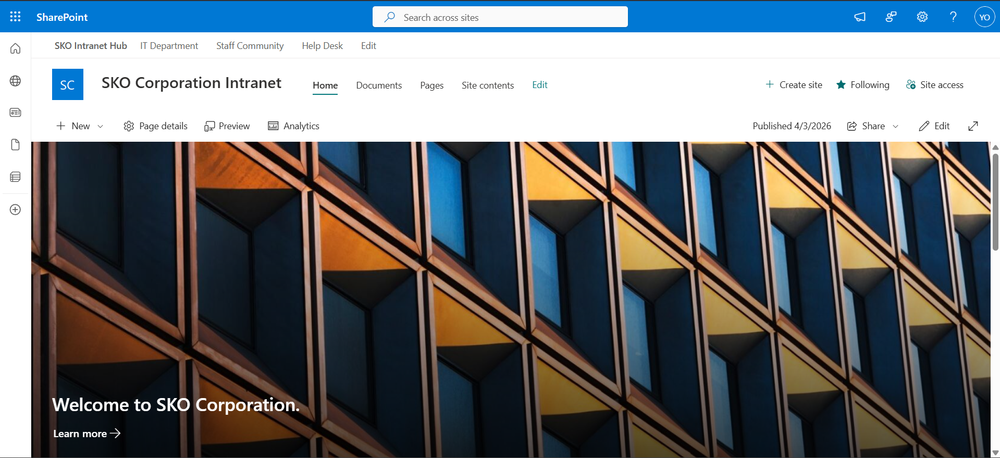
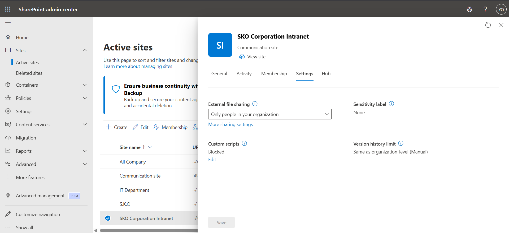
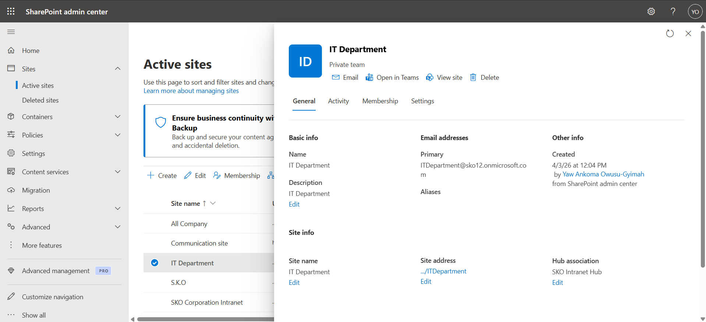
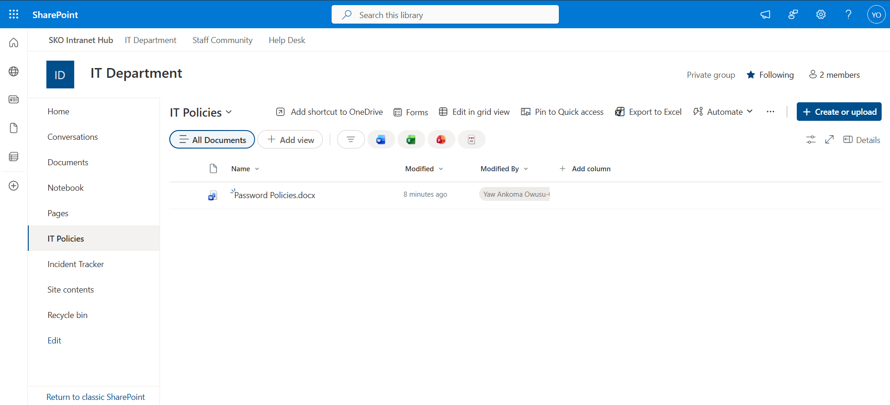
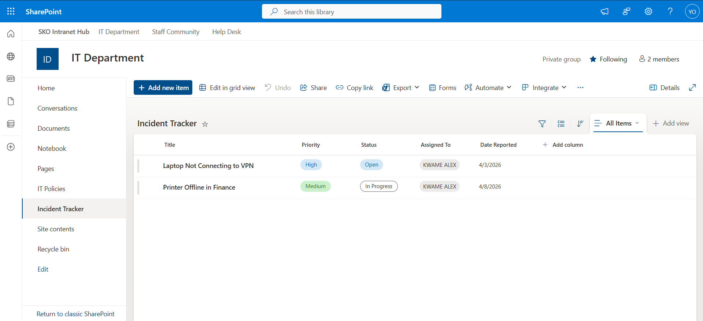

# SharePoint Online Administration Lab — SKO Corporation

## Overview

SKO Corporation is a fictional 120-person organisation used as the basis for this home lab. Prior to this project, staff had no central intranet — files were shared over email, there was no company-wide communication platform, and the IT team had no dedicated collaboration space. 

As the IT Administrator for SKO Corporation, I was tasked with designing and deploying a full SharePoint Online environment from scratch using the existing Microsoft 365 tenant (`sko12.onmicrosoft.com`). The environment was built across three layers: a hub site serving as the company intranet, a private team site for the IT department, and a public communication site for all staff.

---

## Environment

| Item | Detail |
|---|---|
| Tenant | sko12.onmicrosoft.com |
| Admin account | Global Administrator |
| SharePoint domain | sko12.sharepoint.com |

---

## Architecture

```
SKO Corporation Intranet Hub  (/sites/intranet)
├── IT Department Team Site   (/sites/IT-Department)
│   ├── IT Policies (Document Library)
│   └── Incident Tracker (SharePoint List)
└── SKO Staff Community       (/sites/SKO-Community)
    ├── Homepage (News, People, Quick Links, Hero)
```

---

## Layer 1 — Hub Site (SKO Corporation Intranet)

### Business context
SKO Corporation had no central starting point for staff accessing company information. The CTO requested a hub that all future internal sites would connect to, providing consistent navigation and branding across the environment.

### Actions taken

**1. Created the Communication site**
- Navigated to SharePoint Admin Center → Active sites → Create → Communication site
- Site name: `SKO Corporation Intranet`
- URL: `https://sko12.sharepoint.com/sites/intranet`
- Template: Communication site

**2. Registered as a hub site**
- Selected the site in Active sites → Hub → Register as hub site
- Hub name: `SKO Intranet Hub`
- This enables all future associated sites to inherit global navigation and theme automatically

**3. Configured hub navigation**
- Added three navigation links to the hub bar:
  - IT Department → `https://sko12.sharepoint.com/sites/IT-Department`
  - Staff Community → `https://sko12.sharepoint.com/sites/SKO-Community`
  - Help Desk → `https://sko12.sharepoint.com/sites/intranet`

**4. Designed the homepage**
- Edited the homepage and added the following web parts:
  - Hero web part — welcome banner for SKO Corporation
  - News web part — company announcements feed
  - Quick Links web part — shortcuts to key resources
  - People web part — IT team members display

**5. Applied sharing policy**
- SharePoint Admin Center → Active sites → IT Department → Policies → Sharing
- Set to: Only people in your organisation
- Rationale: The hub site must not be accessible to external guests under any circumstance






### Result
A registered hub site was deployed and confirmed active in the SharePoint Admin Center. The hub navigation bar propagates automatically to all associated sites, providing consistent branding and navigation across the SKO environment without requiring manual updates on each site.

---

## Layer 2 — IT Department Team Site

### Business context
The IT team had no shared space to maintain policies or track support incidents. Policy documents were stored in individual email inboxes, and incident tracking was done informally. This created risk around outdated procedures and no visibility into open issues.

### Actions taken

**1. Created the Team site**
- SharePoint Admin Center → Active sites → Create → Team site
- Site name: `IT Department`
- URL: `https://sko12.sharepoint.com/sites/IT-Department`
- Privacy: Private — only IT staff can access this site

**2. Associated to the hub**
- Active sites → IT Department → Hub → Associate with a hub → SKO Intranet Hub
- The hub navigation bar now appears on this site automatically

**3. Configured permissions**
- Settings → Site permissions → confirmed Private site
- Owner: IT Admin account
- Members: IT Staff (in a production environment, this would be a security group synced from Active Directory via Entra Connect)
- Visitors: none — no read access for general staff

**4. Created IT Policies document library**
- Site → New → Document library → named `IT Policies`
- Enabled versioning: Library settings → Versioning settings → Create major versions
- Uploaded a sample document: `Password Policy.docx`
- Versioning ensures that policy changes are tracked and previous versions can be restored if needed

**5. Created Incident Tracker list**
- Site → New → List → Blank list → named `Incident Tracker`
- Added the following custom columns:

| Column | Type | Options |
|---|---|---|
| Title | Single line of text | Default |
| Priority | Choice | High, Medium, Low |
| Status | Choice | Open, In Progress, Closed |
| Assigned To | Person | — |
| Date Reported | Date and time | — |

**6. Added sample incident records**

| Title | Priority | Status |
|---|---|---|
| Laptop not connecting to VPN | High | Open |
| Printer offline in Finance | Medium | In Progress |

**7. Set external sharing to disabled**
- Active sites → IT Department → Policies → Sharing → Only people in your organisation
- No external sharing is permitted for internal IT operational data


### Result
A private team site was deployed for the IT department with a functioning document library (versioning enabled) and a structured incident tracking list. The site is isolated from general staff access and confirmed locked to internal-only sharing via PowerShell.

---

## Layer 3 — SKO Staff Community (Communication Site)

### Business context
SKO staff had no centralised source of company-wide information or announcements. The Head of Operations requested a read-only portal that all 120 staff could access for news, contact information and key links — without the ability to accidentally modify content.

### Actions taken

**1. Created the Communication site**
- SharePoint Admin Center → Active sites → Create → Communication site
- Site name: `SKO Staff Community`
- URL: `https://sko12.sharepoint.com/sites/SKO-Community`

**2. Associated to the hub**
- Active sites → SKO Staff Community → Hub → Associate with a hub → SKO Intranet Hub

**3. Configured read-only permissions for all staff**
- Settings → Site permissions → Share site
- Added `Everyone except external users` as Visitors (read-only)
- Removed from Members — general staff cannot edit any content
- Owner and Members: IT Admin only

**4. Designed the homepage**
- Hero web part — Welcome to SKO Corporation banner
- News web part — displays published company announcements
- People web part — IT team contact display
- Quick Links — Help Desk, IT Policies, Staff Directory
- Text web part — IT support contact information

**5. Published a news article**
- Site → New → News post
- Title: `Welcome to the New SKO Staff Portal`
- Body: Introduction to the new intranet and how to navigate it
- Added thumbnail image and published

**6. Disabled external sharing**
- Active sites → SKO Staff Community → Policies → Sharing → Only people in your organisation







### Result
A read-only communication site was deployed for all 120 SKO staff. Permissions were validated to confirm that general staff can view content but cannot edit pages or documents. The published news article confirmed the News web part is live and functional.

---

---

## Skills Demonstrated

- SharePoint Online site creation (Team site and Communication site)
- Hub site registration and site association
- Hub navigation configuration
- SharePoint permissions management (Owners, Members, Visitors)
- Document library creation with versioning enabled
- SharePoint list creation with custom columns
- Web part configuration (Hero, News, People, Quick Links)
- Tenant-level sharing policy management
- SharePoint Online Management Shell (PowerShell) administration and reporting

---

## Related Lab Repositories

- [IT Administration Home Lab](https://github.com/yawankoma/IT-Administration-Home-Lab)
- [Active Directory and Microsoft 365 Lab](https://github.com/yawankoma/Active-Directory-and-Microsoft365-Lab)
- [User Onboarding With Device Preparation](https://github.com/yawankoma/User-Onboarding-With-Device-Preparation)
